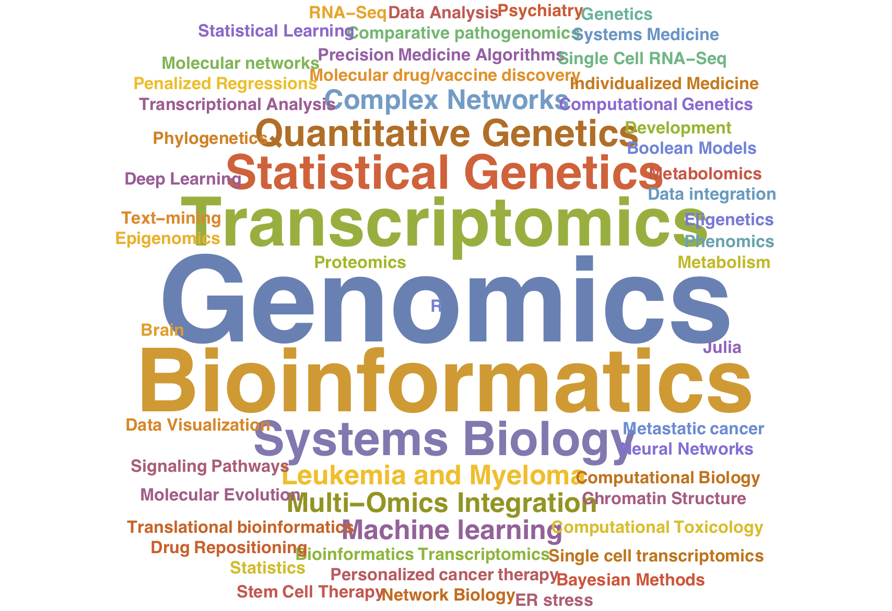

# Welcome to the 2019 Conference on Computational Health
## Bridging the gap between computational science and the clinic
### Join us on August 27th in Grand Rapids Secchia Center!

Featuring Researchers from Michigan State University, Helen De Vos Children’s Hospital, Spectrum Health and the Van Andel Institute

**REGISTRATION IS NOW CLOSED** 

**Twitter**: #CoCoH2019

Hosted by the [Systems Computational Omics group @MSU](https://omics.natsci.msu.edu)

As we move towards clinical implementations of precision medicine, aided by now accessible omics technologies (genomics, transcriptomics, proteomics, metabolomics) and large clinical-grade data generation, computation is becoming an essential component of modern medicine that can revolutionize healthcare. The one-day Conference on Computational Health will showcase the newest research in computational biology and health at Michigan State University, from the Systems Computational Omics group, and highlight the interdisciplinary connections between computational and statistical work, and clinical research. The social program will focus on facilitating cross-disciplinary connections between computational and clinical/experimental researchers, that may lead to fruitful translational collaborations towards improving global healthcare. 

## Confirmed Agenda
<a href="https://github.com/systems-computational-omics/CoCoH2019/raw/master/CoCoH2019_Schedule.pdf" download="CoCoH2019_Schedule.pdf">Download Schedule PDF
</a>
<a href="https://github.com/systems-computational-omics/CoCoH2019/raw/master/CoCoH2019_Posters.pdf" download="CoCoH2019_Posters.pdf">Download Poster List PDF
</a>
- 3 Keynote Speakers!
  - Keith English (MSU Pediatrics and Human Development)
  - Surender Rajasekaran (Helen DeVos Children's Hospital/Spectrum Health)
  - Hui Shen (Van Andel Institute)
  
- 12 faculty talks!
  - Adam Alessio (CMSE, BME, Radiology; IQ Center)
  - Sudin Bhattacharya (BME; IQ Center)
  - Gustavo de los Campos (Epidemiology & Biosatatistics, Statistics & Prob., IQ Center)
  - Bin Chen (Pediatrics and Human Development, Pharmacology and Toxicology)
  - Yuehua Cui (Statistics and Probability)
  - Arjun Krishnan (CMSE)
  - George I. Mias (Biochemistry and Molecular Biology, IQ Center Systems Biology, CNS/CHM)
  - Carlo Piermarocchi (Physics and Astronomy)
  - Jeremy W Prokop (Pediatrics and Human Development, Pharmacology and Toxicology)
  - Janani Ravi (Pathobiology, CVM)
  - Ana I Vazquez (Epidemiology & Biosatatistics, IQ Center)
  - Yuying Xie (CMSE)

- 17 Poster presentations!
- Research Networking Sessions!

## Organizing Team
**East Lansing** 
* George Mias
* Arjun Krishnan
* Janani Ravi
* Carlo Piermarocchi

**Grand Rapids**  
* Keith English
* Jeremy Prokop
* Bin Chen

## Sponsors
- MSU College of Human Medicine
- MSU College of Natural Science
- Spectrum Health
- Institute for Quantitative Health Science and Engineering

## Support or Contact

Questions on the upcoming event/sponsorship?  
Please email [George Mias](mailto:gmias@msu.edu)
